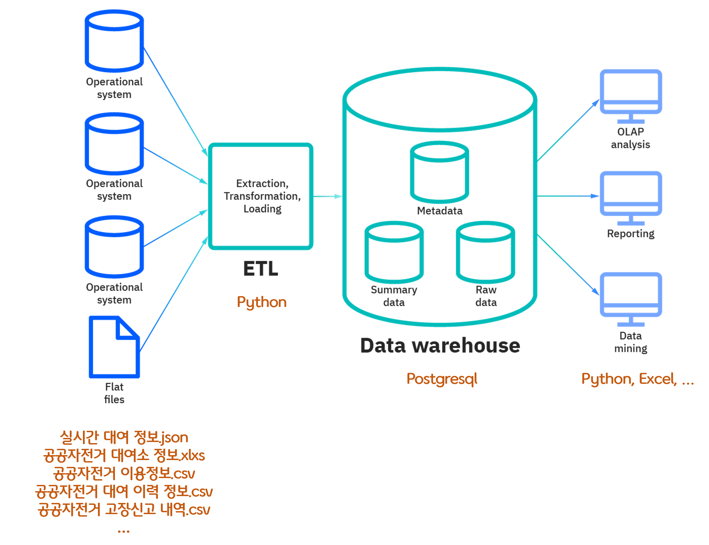
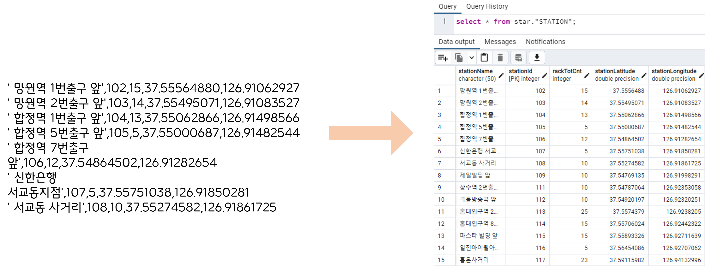
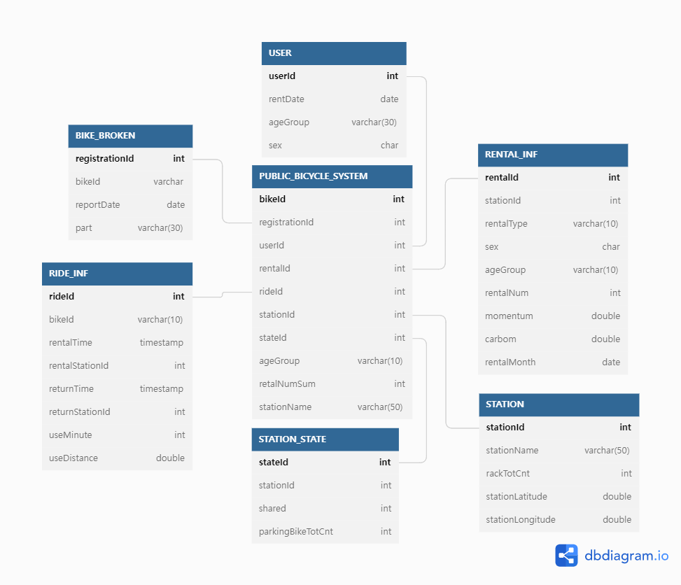
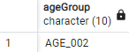
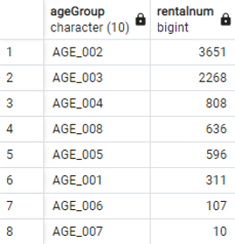
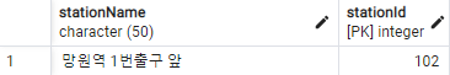
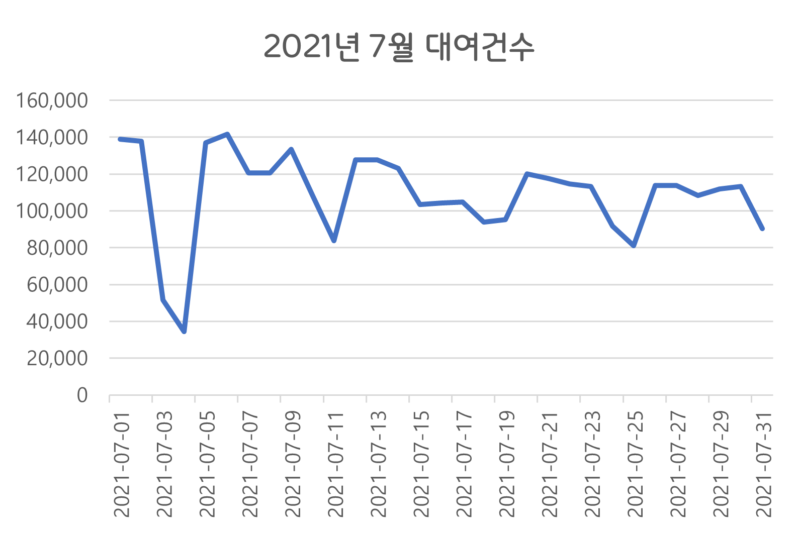
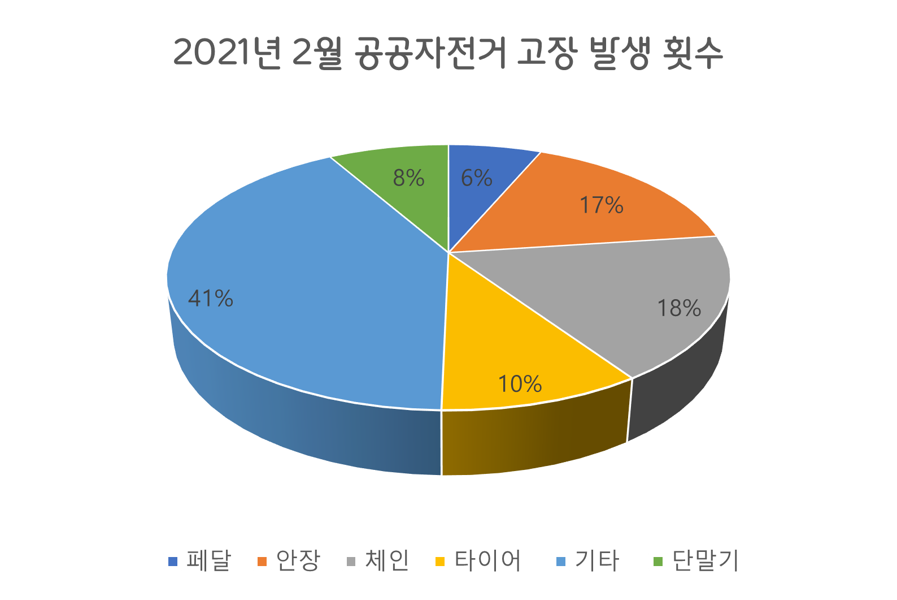
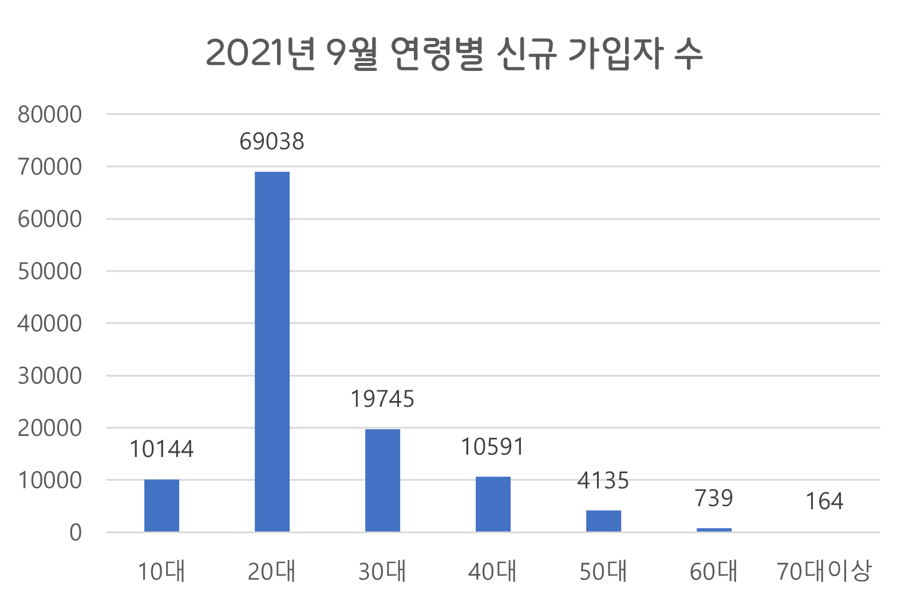

# 빅데이터 기술을 이용한 데이터 분석 사례 구축

- 2022학년도 1학기 데이터베이스 특론 강의 마지막 과제
- 데이터 수집 및 data warehouse 구축, 분석 과정을 통해 빅데이터의 전반적인 이해

## 1. 사용 데이터
- 서울 열린데이터 광장에서 제공하는 다양한 공공자전거(따릉이)에 대한 공공 데이터들을 수집하고 분석

## 2. 전체 흐름

Data warehouse structure from [IBM](https://www.ibm.com/cloud/learn/data-warehouse)

- 여러 형식의 따릉이 데이터들을 ETL 과정을 거쳐 postgresql로 구축된 data warehouse에 로드한 뒤에 python과 excel을 통해서 분석하는 과정을 거친다.

## 3. ETL
- Extract
    * 서로 다른 확장자 파일들에서 데이터를 추출한다.
    

- Transform
    * 데이터의 의미는 동일하지만 표기가 다른 데이터나 null 등 추출한 데이터들을 변환한다.
    
    

- Load
    * 변환된 데이터들을 적재한다.
    

## 4. Data Warehouse Star Schema

## 5. 데이터 처리 및 분석
1. 2018년 8월~9월동안 가장 많이 가입한 연령대 구하기

~~~
SELECT ruser."ageGroup" FROM (SELECT "NEW_USER"."ageGroup", SUM("NEW_USER"."subscriptionNum") AS num From star."NEW_USER" WHERE "NEW_USER"."rentDate" >= '2018-08-01’ AND "NEW_USER"."rentDate" < '2022-10-01’ GROUP BY "NEW_USER"."ageGroup" ORDER BY num DESC limit 1) AS ruser;
~~~

2. 2021년 12월의 연령별 대여 횟수 구하기

~~~
SELECT "ageGroup", sum("rentalNum") AS rentalNum FROM "RENTAL_INF" WHERE "RENTAL_INF"."rentalMonth" >= '2021-12-01’ AND "RENTAL_INF"."rentalMonth" < '2022-01-01' GROUP BY "ageGroup" ORDER BY rentalNum DESC;
~~~

3. 2021년 12월 한달동안 가장 많이 대여한 대여소 이름과 id

~~~
SELECT "STATION"."stationName", "STATION"."stationId" FROM "STATION" WHERE "STATION"."stationId" = (SELECT sq."rentalStationId" FROM (SELECT DISTINCT "RIDE_INF"."rentalStationId", count(*) AS cnt FROM "RIDE_INF“ WHERE "RIDE_INF"."rentalTime" >= '2021-12-01' and "RIDE_INF"."rentalTime" < '2022-01-01’ GROUP BY "RIDE_INF"."rentalStationId" ORDER BY cnt DESC limit 1) AS sq);
~~~

## 6. 분석 응용

